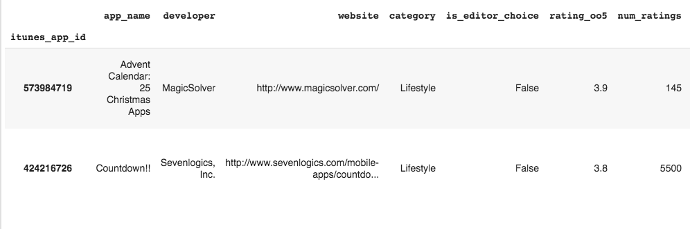
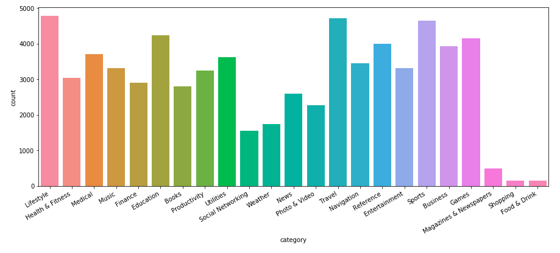
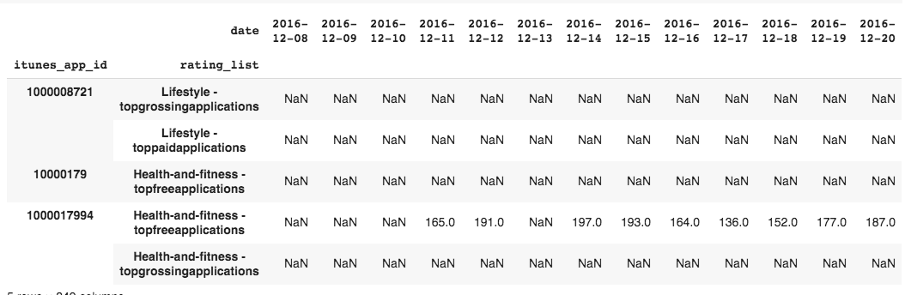
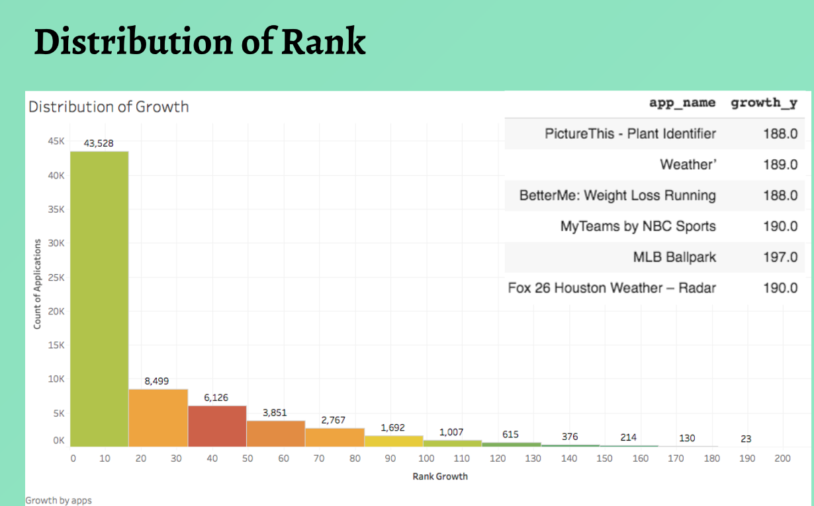
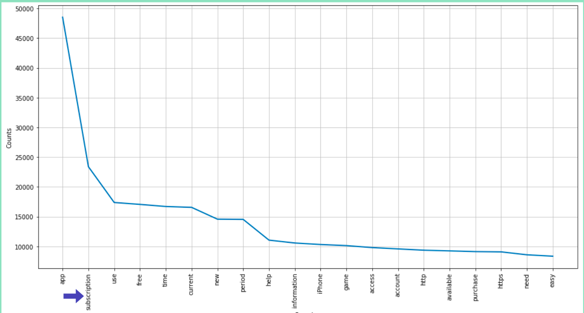
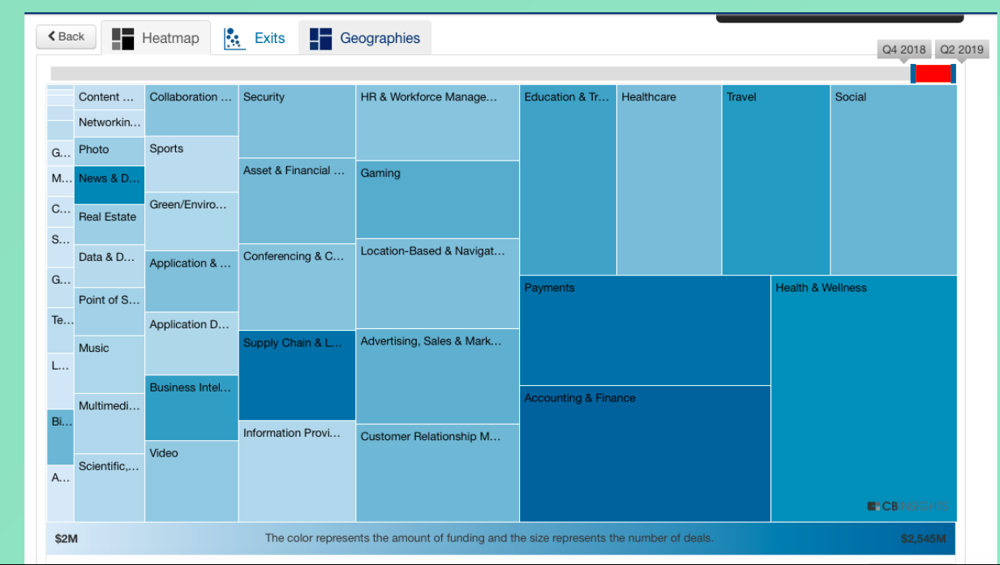
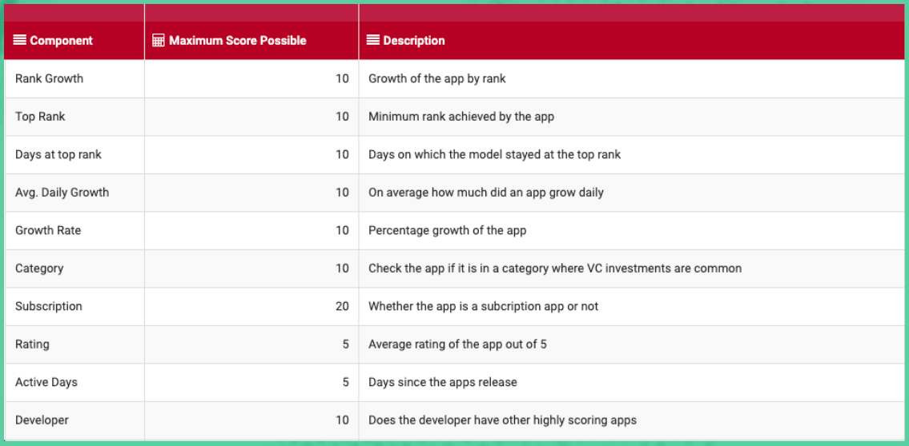
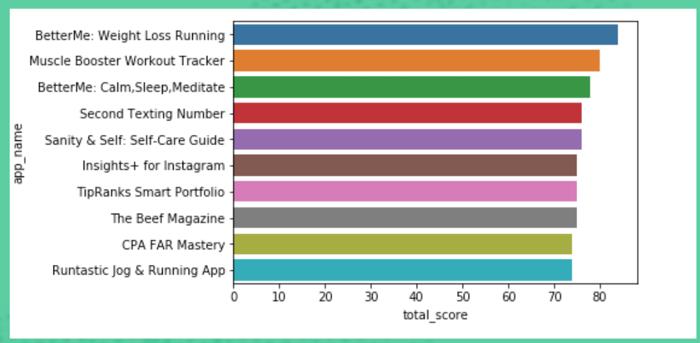
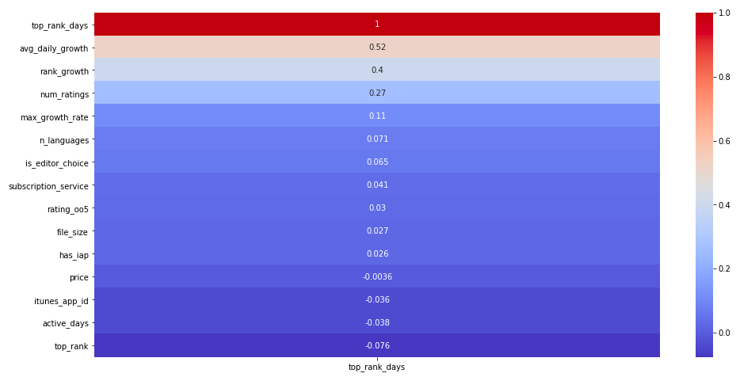
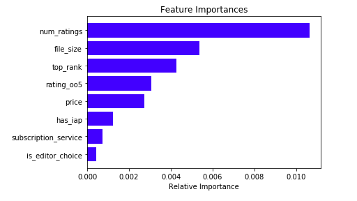

# Detecting interesting VC investments

2019 analysis of ~68,000 real iOS App Store listings: given a pool of apps and three years of ranking history, which ones look like venture-capital candidates?

This repository keeps the **original scoring rules, reference apps, and conclusions**. It does not add new investment picks. The code was updated so the project runs on current Python instead of a 2019 Google Colab session.

**Not investment advice.** Rankings and scores describe a 2019 snapshot of App Store data.

## Question

1. From listing metadata and rank history, surface apps that look like VC candidates (growth, consistency, category, subscription, developer track record).
2. Check whether **days spent at an app's best rank** (consistency) can be predicted from the same features.

## Method

### Data

Two raw tables were used in the original Colab work:

- **App info** — listing fields visible on the App Store page (`itunes_app_id`, name, developer, category, editor's choice, rating, IAP, release date, size, languages, price, description, …).

  

- **Ranking panel** — daily ranks for about three years, with many missing values.

The pickle files for those tables are **not in git** (they lived on Google Drive). What *is* shipped is the derived scoring table. See [data/README.md](data/README.md).



### Rank imputation

Null ranks were filled with a conservative **forward fill** (carry the last known rank) and then a **backward fill** for histories that started empty.



### Features taken from the rank panel

| Feature | Definition |
| --- | --- |
| Top rank | Best (lowest) rank in the window |
| Rank growth | Worst rank − rank on the last day |
| Days at top rank | How long the app stayed at its best rank |
| Average daily growth | Rank growth ÷ age (capped at 1,095 days), to soften a ceiling effect |
| Max growth rate | Rank growth as a share of (top rank + rank growth) |



### Other features

- **Subscription.** Tokenizing descriptions of highly rated apps, the strongest signal was subscription language (`subscription`, `renewal`, `subscribe`). Apps the investors had already marked as interesting were subscription apps.
- **Age / active days.** Earlier-stage apps with strong rank movement are more interesting than mature ones sitting still.
- **Category.** Health & Fitness, Finance, Social Networking, Travel, and Education received extra weight from then-current CB Insights VC activity (2019).
- **Developer portfolio.** Developers with more than one high-growth app received a bonus.





### Scoring model

Each derived metric is cut into bins and weighted. Subscription is a 0/20 flag. Category and developer bonuses are added. Apps are ranked by **total score**.





The original notebook also listed a **reference set** of apps investors had already called interesting (the “magic 15”, with Netflix commented out). Those names are a benchmark, not model output:

The Action Network, ESPN, AllTrails, Headspace, Quizlet, Duolingo, The Athletic, Prodigy Math Game, onX Hunt, HOOKED, Crunchyroll, The Wall Street Journal, MLB At Bat, Surfline.

Re-running the same rules on the shipped table, the highest-scoring apps are led by **BetterMe: Weight Loss Running** (score 84), then Muscle Booster Workout Tracker, BetterMe: Calm,Sleep,Meditate, and other subscription Health/Fitness and Finance apps. That ranking is a reproduction of the 2019 model, not a 2026 recommendation.

### Consistency model

Linear regression, k-NN, a decision tree, boosted trees, and a random forest were trained to predict **days at top rank**. In the original Colab run (sklearn 0.20, random forest default `n_estimators=10`), the random forest reached about **95%** R² on the held-out split after a small grid search.





The shipped CSV does not include `is_editor_choice` or the unshipped raw merge, so the runnable fallback **does not reproduce the 95% figure**. That number is the original Colab result on the full cleaned table. On the shipped extract, a random forest is a weak predictor of `top_rank_days` (most apps spent a single day at their best rank). The target definition and the rest of the feature list are unchanged.

## How to run

Python 3.10+ (3.12 works). From the repository root:

```bash
python3 -m venv .venv
source .venv/bin/activate   # Windows: .venv\Scripts\activate
pip install -r requirements.txt
```

### Reproduce the scoring model (no Jupyter required)

```bash
python -m vc_investments --save
pytest
```

`--save` writes `outputs/top_scorers.csv` (same top names as the notebook) and `outputs/reference_apps.csv`.

### Notebooks

Install a kernel if needed (`python -m ipykernel install --user`), then open from the repo root so relative `data/` paths work.

| Notebook | Needs | What it does |
| --- | --- | --- |
| `TCG_scoring_model.ipynb` | `data/frame_scoring_model.csv` (shipped) | Binning, weights, top scorers, reference apps |
| `EDA_and_Machine_Learning_TCG.ipynb` | scoring CSV, or `data/final_analysis_frame.csv` if you rebuilt it | Cleaning (when raw merge is present), plots, consistency models |
| `TCG_Data_preparation.ipynb` | `data/raw/app_info_df.pkl` and `app_rank_df.pkl` | Imputation, rank features, subscription flag, merge |

```bash
jupyter notebook TCG_scoring_model.ipynb
```

### If you have the original pickles

Put them in `data/raw/` as described in [data/README.md](data/README.md), then run the data-prep notebook. It writes `data/final_analysis_frame.csv` for the EDA notebook. Those pickles are large and are **not** part of this PR.

## Project layout

```text
data/                  # shipped CSVs + notes on missing pickles
images/                # figures from the original write-up
vc_investments/        # scoring + consistency helpers
tests/                 # checks that scoring still matches the 2019 rules
TCG_*.ipynb            # original analysis, paths and APIs updated
```

## Compatibility notes

The 2019 notebooks used Python 3.6, pandas 0.24-era APIs, and Colab Drive mounts. The updates:

- Load CSVs from `data/` instead of the Colab working directory or `/content/drive/My Drive/TCG/`.
- Replace `fillna(method=...)` with `ffill` / `bfill`.
- Pass `axis=` to `drop` / `concat` (required in pandas 2+).
- Use `corr(numeric_only=True)`, `histplot` instead of `distplot`, and `countplot(x=...)`.
- Convert `pd.cut` scores to numbers **before** summing (categorical dtypes no longer add the way they did in 2019).
- Set `RandomForestRegressor(n_estimators=10)` so the first forest matches sklearn 0.20's default.

## License

The original repository did not include a license file. Treat the analysis as the author's 2019 coursework unless the owner adds terms.
